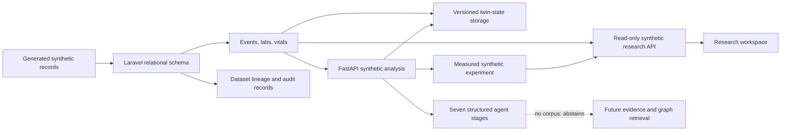

# Architecture

**Research prototype — not a medical diagnosis or treatment system.** The current slice combines Laravel synthetic cohort storage/exploration with a local FastAPI descriptive analysis service. It has no trained medical model, public literature corpus, production graph/vector store, or clinical prediction.

## Boundaries

- Laravel 12 owns users, project/dataset metadata, relational records, authorization boundaries, queue coordination, and audit events.
- The Laravel API exposes status, read-only synthetic cohort exploration, and a rate-limited synthetic experiment action that persists metrics and audit metadata. Python accepts only synthetic fixture identifiers/units for trajectory, twin, and structured-agent operations.
- The Python evaluator measures a static versus temporal baseline and compares centralized with simulated federated sufficient-statistic regression. This is a generated-data software experiment only.
- The database contains relational metadata and records. `patient_embeddings` stores an adapter reference; it is not a vector database. Graph tables are a relational graph layer, not a graph database server.
- Python packages are present for `medical_nlp/`, `multimodal/`, `time_series/`, `digital_twin/`, `knowledge_graph/`, `medical_rag/`, `agents/`, `federated_learning/`, `evaluation/`, `explainability/`. Only time-series summaries, twin materialization, structured abstaining agent stages, and synthetic baseline evaluation currently contain active behavior.
- Planned infrastructure includes MySQL 8+, Redis queues/cache, a separately selected vector store and graph store, Docker, and experiment tracking. None is configured by Phase 1.

## Relational Model

| Area | Tables | Key design |
|---|---|---|
| Governance | `users`, `research_projects`, `datasets`, `audit_logs` | Ownership, access/de-identification status, source checksums, lineage |
| Cohort | `patients_synthetic`, `patient_events`, `patient_timeline` | Dataset-scoped subject keys and event-time indexes |
| Modalities | `clinical_documents`, `lab_results`, `vital_signs`, `medical_images` | Separate structured modalities, source references, dates, and metadata |
| Graph/evidence | `medical_entities`, `medical_relations`, `knowledge_graph_nodes`, `knowledge_graph_edges`, `evidence`, `citations` | Ontology identifiers, typed edges, source/citation provenance |
| Representations | `patient_embeddings`, `digital_twin_states` | Versioned state and modality coverage; external vector references |
| Models/agents | `model_versions`, `agent_runs`, `risk_predictions` | Structured output and confidence, no hidden reasoning traces |
| Evaluation | `experiment_runs`, `evaluation_metrics` | Frozen protocol/configuration and run-derived metrics |

The tables are normalized at entity boundaries; JSON is reserved for variable metadata, provenance, state snapshots, and structured outputs. A database migration does not itself provide authorization; project ownership policies and authenticated write endpoints are required before non-demo records are introduced.

## Data Flow

For the demo: generated fixture seed → normalized relational records → read-only Laravel API → selected synthetic timeline. Separately, a synthetic request can enter FastAPI for a descriptive trend, twin snapshot, or structured agent workflow; experiment requests run fixed generated fixtures, return measured metrics, and are recorded by Laravel with protocol and audit metadata. Production extension remains source review → permission/de-identification checks → modality validation → normalized records/lineage → versioned twin → optional graph/evidence retrieval → pinned model/agent → evaluation → audited and evidence-linked result.